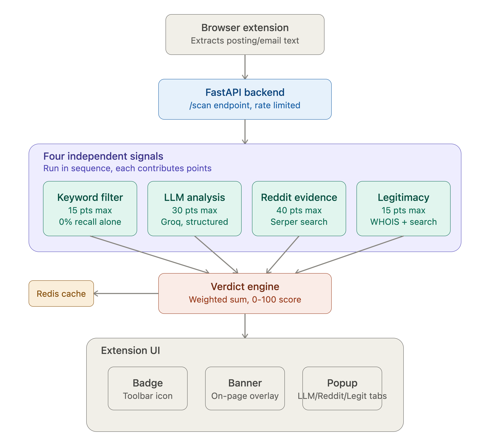

# Suspicious-o-meter

A browser extension + backend that automatically scans job postings and emails for scam red flags. It combines LLM-based text analysis, real-world evidence from Reddit/web search, and company legitimacy checks (domain age, online presence) into a single suspicion score — rather than relying on any one signal alone.

**Live backend:** https://suspicious-o-meter.onrender.com


## The problem

Job and internship scams increasingly avoid obvious giveaway language ("wire us money," "send gift cards") in favor of plausible, well-written postings — fake training programs, unverifiable partnership claims, artificial urgency. A simple keyword filter cannot catch these; a single LLM call reading only the posting text can miss them too, since some scams have no textual red flags at all and are only identifiable through external evidence (e.g. public reports elsewhere).

## Architecture

```


Browser extension (content script)
   → extracts posting/email text from the page
   → sends to backend /scan endpoint

Backend (FastAPI)
   → runs 4 independent signals in sequence:
       1. Keyword filter        (fast, free, catches only the most blatant cases)
       2. LLM analysis (Groq)   (structured prompt: role/task/constraints/output format)
       3. Reddit/web evidence   (via Serper search API, relevance-filtered)
       4. Legitimacy checks     (WHOIS domain age + online presence)
   → combines all 4 into one weighted suspicion score (0-100)
   → caches the result in Redis (keyed by content hash, 24h expiry)
   → returns score + verdict + per-signal breakdown

Extension UI
   → toolbar badge (color-coded score)
   → floating on-page banner
   → popup with LLM / Reddit / Legitimacy tabs
```

## Tech stack

- **Backend:** Python, FastAPI, deployed on Render
- **LLM:** Groq (`openai/gpt-oss-20b`)
- **Evidence search:** Serper (Google Search API) — used for Reddit evidence retrieval, pivoted from Reddit's own API after their new approval requirement made direct access impractical within the project timeline
- **Legitimacy checks:** WHOIS API (domain age) + Serper-based company existence check (OpenCorporates application submitted but pending approval, so this is a documented interim substitute)
- **Caching:** Redis (Upstash)
- **Rate limiting:** slowapi (10 requests/minute per IP)
- **Error monitoring:** Sentry
- **Extension:** Manifest V3, vanilla JS content script + popup
- **Testing:** pytest (endpoint tests + isolated scoring-logic tests)

## Ensemble scoring

Each signal contributes points toward the total suspicion score:

| Signal | Max points |
|---|---|
| LLM verdict | 30 (SCAM=30, SUSPICIOUS=15, LEGIT=0) |
| Keyword filter | 15 |
| Reddit/web evidence | 40 |
| Legitimacy checks | 15 |

**0-19 → LEGIT · 20-49 → SUSPICIOUS · 50-100 → SCAM**

Reddit evidence is weighted highest because it represents real-world corroboration rather than a text-only guess — during development, this signal caught a scam (a fake internship listing) that both the LLM and keyword filter scored as completely clean.

## Known limitations

- **No single signal is reliable alone.** A rule-based keyword filter, tested against real scam samples, achieved 100% precision but 0% recall — it caught none of the real scams, because modern scam language avoids obvious trigger words. This is the empirical justification for the ensemble approach.
- **Some scams are undetectable by this system.** A posting with no textual red flags and no public online trace (no Reddit reports, a plausible legitimacy footprint) will score as LEGIT. This was confirmed directly during testing with a fabricated-company sample.
- **Reddit evidence scoring uses keyword presence, not sentiment.** The system can distinguish irrelevant results from relevant ones (via company-name matching), but cannot yet distinguish "this company is a scam" from "this company was impersonated by scammers" or "this company is legit, scammers copied their name" — all of which can trigger similar keyword matches. A more accurate approach would require a dedicated sentiment/stance classification step.
- **Company-name and domain extraction from LLM output is not fully reliable**, especially on long, messy real-webpage text (vs. curated test samples). Incorrect extraction can lead to searching the wrong entity.
- **LLM verdicts are not fully deterministic** — the same posting can occasionally receive different verdicts across runs.
- **Reddit's official API now requires an approval process** that wasn't feasible within the project timeline; evidence retrieval uses a general search API with a Reddit filter as a substitute.
- **OpenCorporates access is pending approval**; company legitimacy currently relies on a search-based proxy rather than an authoritative company registry.
- **Render's free tier spins down after inactivity**, so the first request after a period of idleness can take 50+ seconds.

## Running locally

```bash
pip install -r requirements.txt
cp .env.example .env   # fill in your own API keys
uvicorn main:app --reload
```

Load the extension via `chrome://extensions` → Developer mode → Load unpacked → select the `extension/` folder.

## Testing

```bash
pytest test_main.py -v            # endpoint-level tests
pytest test_verdict_engine.py -v  # scoring logic tests (no API calls, fast)
```

## Security

A security review was done before shipping. What was fixed, and what remains a limitation:

**Prompt injection (mitigated, not eliminated)**
- Scanned text is wrapped in delimiters and the prompt tells the model to treat it as untrusted data, never as instructions.
- Delimiter markers are stripped from the input so a posting can't close the wrapper early.
- Input to the LLM is capped at 4,000 characters, and the parser only accepts a verdict from a line that starts with `VERDICT:`.
- Regression tests (`pytest -m integration`) run direct-injection and delimiter-escape attacks against the live model. No defense against prompt injection is absolute, so this reduces the risk rather than removing it.

**Query sanitization**
- The company name and domain come from LLM output, so they are cleaned before they reach Serper or WHOIS: quotes, colons, parentheses, and leading hyphens are removed, lengths are capped, and domains are validated. This stops a crafted posting from adding search operators to skew the evidence.

**Web security**
- CORS only allows the extension, localhost, and the sites the extension runs on (Gmail, LinkedIn, Indeed). This is not authentication: anyone can still call the API directly.
- Rate limiting is 10 requests per minute per client IP on `/scan`.
- Internal errors return a generic message. Stack traces stay in server logs only.
- The extension renders all scanned or returned text with `textContent`, never `innerHTML`.

**Privacy**
- Scanning is automatic: the extension sends the text of the open job posting or Gmail email to the backend when a page loads.
- The full text goes to Groq for analysis. Serper receives only the company name, and WHOIS only the domain.
- Email text is not logged or stored. Sentry is configured not to capture request bodies or local variables.
- Results (score, verdict, company name) are cached in Upstash Redis for 24 hours, keyed by a hash of the text.

**Known limitations**
- The free Groq tier limits tokens per minute, so heavy use returns a "service busy" message.
- A single weak signal (for example, only the LLM saying SUSPICIOUS) scores 15 and still shows as LEGIT. The SUSPICIOUS label needs at least 20 points.